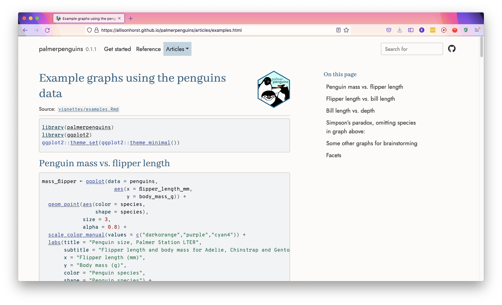

```{r setup, include=FALSE}
options(htmltools.dir.version = FALSE, dpi = 300, warning = FALSE, message = FALSE)
```

```{r xaringan-themer, include=FALSE, warning=FALSE}
library(xaringanthemer)
style_solarized_light()
```

# Goal for today

Thank you for coming! <3 Please help yourself to tea/coffee and cookies.

--

.pull-left[
- What is R-Ladies Trondheim?

- Introduction to the package `ggplot2`

- Brief example of how to plot flowers in `ggplot2`

- Future of R Ladies Trondheim

- Talk at the tables: Who are you and why are you here?

- Cookies and mingling
]

.pull-right[
```{r, echo = FALSE, out.width = "300px"}

```
]


---

# Who am I?

- Doing a PhD in statistics at the Department of mathematical sciences at NTNU

- Finished in September: feel sad about leaving the university, and maybe starting a job where I can't use R :'( 

- Hope that R Ladies Trondheim can encourage connections between academia and industry, and across different departments at the university.


---
class: inverse, center, middle

# Get Started with `ggplot2`

---
# Why `ggplot2`?

- It gives you a recognizable system - when you have understood the structure of `ggplot2` it is very easy to understand how to modify things to get exactly the plot you want. 
- When you have learned how to tweak the layout it is really easy to create your own style.

Example: [(here is a tutorial)](https://r-graph-gallery.com/web-lollipop-plot-with-r-mario-kart-64-world-records.html)

```{r, echo=FALSE, out.width="60%"}
knitr::include_graphics("figs/mario_kart.png")
```

---
# The components of ggplot2

|                 |                                    |
| --------------- | ---------------------------------- |
| `ggplot(data)`  | The **data** that you want to build your graphic on. |
| `aes()`         | **Aesthetic mappings** between your data and visual properties of your graphic. |
| `geom_*()`      | The **geometric shapes** representing the data. |


```{r, eval = FALSE}
ggplot(data, aes(x = ..., y = ..., color = ...)) +
  geom_*()
```


---
# First steps

Install the `ggplot2` package:

```{r, eval = FALSE}
install.packages("ggplot2")
```

Load the package:

```{r}
library(ggplot2)
```

For this tutorial, I'll use the `palmerpenguins` dataset, which you can install and load in the same way:

```{r eval = FALSE}
install.packages("palmerpenguins")
```
```{r}
library(palmerpenguins)
```

---
# A simple plot

Let's first take a look at the structure of our data.

```{r}
head(penguins)
```


```{r}
names(penguins)
```

---
# A simple plot

```{r, eval = FALSE}
ggplot(data = penguins, 
       aes(x = flipper_length_mm, y = body_mass_g))
```
.pull-left[
```{r, echo = FALSE, out.width="90%"}
ggplot(data = penguins, 
       aes(x = flipper_length_mm, y = body_mass_g))
```
]
.pull-right[
Let's say we want to plot the flipper length against body mass. We use the `ggplot()` function, and specify the data set, and what we want on the x- and y-axis. If we run this, we see the initialized plot.
]

---
# A simple plot - Adding points

```{r eval = FALSE}
ggplot(data = penguins, 
       aes(x = flipper_length_mm, y = body_mass_g)) +
  geom_point() #<<
```

.pull-left[
```{r echo = FALSE, warning = FALSE, out.width="90%"}
ggplot(data = penguins, 
       aes(x = flipper_length_mm, y = body_mass_g)) +
  geom_point()
```
]

.pull-right[
To get the actual data on the plot, we need to specify `geom_point()`. The layers of a `ggplot` are added together with a **`+`**. 
]

---
# A simple plot - Color by species

```{r eval = FALSE}
ggplot(data = penguins, 
       aes(x = flipper_length_mm, y = body_mass_g)) +
  geom_point(aes(color = species)) #<<
```

.pull-left[
```{r echo = FALSE, warning = FALSE, out.width="90%"}
ggplot(data = penguins, 
       aes(x = flipper_length_mm, y = body_mass_g)) +
  geom_point(aes(color = species)) #<<
```
]

.pull-right[
To color the points by species, add `aes(color = species)` inside `geom_point()`. 
]

---
# A simple plot - Themes

```{r eval = FALSE}
ggplot(data = penguins, 
       aes(x = flipper_length_mm, y = body_mass_g)) +
  geom_point(aes(color = species)) +
  theme_bw() #<<
```

.pull-left[
```{r echo = FALSE, warning = FALSE, out.width="90%"}
ggplot(data = penguins, 
       aes(x = flipper_length_mm, y = body_mass_g)) +
  geom_point(aes(color = species)) +
  theme_bw() #<<
```
]

.pull-right[
We can make changes to the layout of the plot by specifying a different theme. The default is `theme_gray()`, let's change it to `theme_bw()`. 
]

---
# A simple plot - Color palettes

```{r eval = FALSE}
ggplot(data = penguins, 
       aes(x = flipper_length_mm, y = body_mass_g)) +
  geom_point(aes(color = species)) +
  scale_color_manual(values = c("orange", "darkcyan", "hotpink")) + #<<
  theme_bw() 
```

.pull-left[
```{r echo = FALSE, warning = FALSE, out.width="90%"}
ggplot(data = penguins, 
       aes(x = flipper_length_mm, y = body_mass_g)) +
  geom_point(aes(color = species)) +
  scale_color_manual(values = c("orange", "darkcyan", "hotpink")) + #<<
  theme_bw() 
```
]

.pull-right[
The color palette can be changed through `scale_color_...()`. In this case, we want to specify manual values for the colors, but you could also use ready-made color palettes, [there are lots of them!](https://emilhvitfeldt.github.io/r-color-palettes/discrete.html)
]

---
# A simple plot - Theme options

```{r eval = FALSE}
ggplot(data = penguins, 
       aes(x = flipper_length_mm, y = body_mass_g)) +
  geom_point(aes(color = species)) +
  scale_color_manual(values = c("orange", "darkcyan", "hotpink")) +
  theme_bw() +
  theme(legend.position = "top") #<<
```

.pull-left[
```{r echo = FALSE, warning = FALSE, out.width="90%"}
ggplot(data = penguins, 
       aes(x = flipper_length_mm, y = body_mass_g)) +
  geom_point(aes(color = species)) +
  scale_color_manual(values = c("orange", "darkcyan", "hotpink")) +
  theme_bw() +
  theme(legend.position = "top") #<<
```
]

.pull-right[
In the `theme()` function you can change stuff like background color, font, text sizes and colors, and much more, basically anything that has to do with the layout. There we move the legend to be on the top.
]

---
# A simple plot - Axis and legend titles

```{r eval = FALSE}
ggplot(data = penguins, 
       aes(x = flipper_length_mm, y = body_mass_g)) +
  geom_point(aes(color = species)) +
  scale_color_manual(values = c("orange", "darkcyan", "hotpink")) +
  labs(color = "Species", #<<
       x = "Flipper length (mm)", y = "Body mass (g)") + #<<
  theme_bw() +
  theme(legend.position = "top")
```

.pull-left[
```{r echo = FALSE, warning = FALSE, out.width="60%"}
ggplot(data = penguins, 
       aes(x = flipper_length_mm, y = body_mass_g)) +
  geom_point(aes(color = species)) +
  scale_color_manual(values = c("orange", "darkcyan", "hotpink")) +
  labs(color = "Species", #<<
       x = "Flipper length (mm)", y = "Body mass (g)") + #<<
  theme_bw() +
  theme(legend.position = "top")
```
]

.pull-right[
We can change the axis and legend titles by using `labs()`. The reason we specify `color = "Species"` is that we want the legend for color to have this title. `labs()` is also where you can add a title, subtitle and caption.
]

---

# A simple plot - Fonts

```{r echo = FALSE, message = FALSE, warning = FALSE}
library(showtext)
font_add_google(name = "Josefin Sans", family = "Josefin Sans")
```

```{r eval = FALSE, message = FALSE, warning = FALSE}
library(showtext)
showtext_auto()
font_add_google(name = "Josefin Sans", family = "Josefin Sans")
```

The package `showtext` is great for changing fonts. You can change the font to any font from [Google Fonts](https://fonts.google.com/).

---

# A simple plot - Fonts

```{r eval = FALSE}
ggplot(data = penguins, 
       aes(x = flipper_length_mm, y = body_mass_g)) +
  geom_point(aes(color = species)) +
  scale_color_manual(values = c("orange", "darkcyan", "hotpink")) +
  labs(color = "Species", 
       x = "Flipper length (mm)", y = "Body mass (g)") + 
  theme_bw() +
  theme(legend.position = "top",
        text = element_text(family = "Josefin Sans")) #<<
```

.pull-left[
```{r echo = FALSE, message = FALSE, warning = FALSE, out.width="60%"}
ggplot(data = penguins, 
       aes(x = flipper_length_mm, y = body_mass_g)) +
  geom_point(aes(color = species)) +
  scale_color_manual(values = c("orange", "darkcyan", "hotpink")) +
  labs(color = "Species", 
       x = "Flipper length (mm)", y = "Body mass (g)") + 
  theme_bw() +
  theme(legend.position = "top",
        text = element_text(family = "Josefin Sans")) #<<
```
]

.pull-right[
I used Josefin Sans here to make the change obvious. A nice go-to font is Open Sans.
]

---
# Final penguin figure

```{r echo = FALSE, message = FALSE, warning = FALSE, out.width="60%"}
ggplot(data = penguins, 
       aes(x = flipper_length_mm, y = body_mass_g)) +
  geom_point(aes(color = species)) +
  scale_color_manual(values = c("orange", "darkcyan", "hotpink")) +
  labs(color = "Species", 
       x = "Flipper length (mm)", y = "Body mass (g)") + 
  theme_bw() +
  theme(legend.position = "top",
        text = element_text(family = "Josefin Sans")) #<<
```

---
# More penguin plots

You can see some more examples of `ggplot2` plots with the `palmerpenguin` data [here](https://allisonhorst.github.io/palmerpenguins/articles/examples.html).


---
# **ggplot2** resources

- [The R graph gallery](https://r-graph-gallery.com/): different graphs in base R and ggplot2, many examples and tutorials.

- [ggplot2 cheatsheet](https://raw.githubusercontent.com/rstudio/cheatsheets/main/data-visualization.pdf)

- Tutorial by Cédric Scherer, ["Graphic design with ggplot2"](https://www.cedricscherer.com/2019/08/05/a-ggplot2-tutorial-for-beautiful-plotting-in-r/) 
  - .small[A really great reference, goes into _great_ detail of all the options of ggplot2]


---

class: center, middle

Slides created via the R package [`xaringan`](https://github.com/yihui/xaringan), all code is available [on GitHub](https://github.com/emmaSkarstein/R-Ladies-Trondheim).

---

class: inverse, center, middle

# Plotting flowers

---

class: inverse, center, middle

# Next steps for R Ladies Trondheim

---

# Next steps for R Ladies Trondheim

- What kind of meetings are useful? Workshops, talks, co-working, just chatting?
- Potential talks/workshops:
  - CV in RMarkdown
  - Making slides using Xaringan
  - Using R in data journalism
  - Writing academic articles using Quarto
  - Making your own website in R
  - Creating R packages
  - Reproducible research reports using RMarkdown

---

class: center, middle

Slides created via the R package [`xaringan`](https://github.com/yihui/xaringan), all code is available on GitHub: https://github.com/emmaSkarstein/R-Ladies-Trondheim 

---

