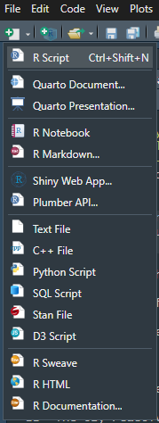
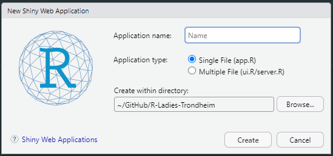

```{r setup, include=FALSE}
knitr::opts_chunk$set(echo = TRUE)
```

## What is R Shiny? {.build}

> Shiny is an R package that makes it easy to build interactive web applications (apps) straight from R

R language is translated into the language(s) of the web (JavaScript, CSS, HTML)

Can have R data processing in the background

Classic R plotting aesthetics - but interactive!

## Some inspiration

[Fertility statistics](https://fluxapp.utu.fi/)

[Crisis vaccination planner](https://shiny.dide.imperial.ac.uk/)

[Lyme disease overview](https://www.hopkinslymetracker.org/overview/)

[Wastewater monitoring of infectious diseases](https://wise.ethz.ch/)


## Basic app set up {.smaller}

<div class="columns-2">


<br>

1. Select Shiny Web App

2. Give your application a name

3. Select the directory for saving

4. Click create
</div>

## User interface (ui) {.smaller}

```{r, ui_default, eval=FALSE, echo=TRUE}
# Define UI for application that draws a histogram
ui <- fluidPage(

    # Application title
    titlePanel("Old Faithful Geyser Data"),

    # Sidebar with a slider input for number of bins 
    sidebarLayout(
        sidebarPanel(
            sliderInput("bins",
                        "Number of bins:",
                        min = 1,
                        max = 50,
                        value = 30)
        ),

        # Show a plot of the generated distribution
        mainPanel(
           plotOutput("distPlot")
        )
    )
)
```

## Server {.smaller}

```{r, server_default, eval=FALSE, echo=TRUE}
# Define server logic required to draw a histogram
server <- function(input, output) {

    output$distPlot <- renderPlot({
        # generate bins based on input$bins from ui.R
        x    <- faithful[, 2]
        bins <- seq(min(x), max(x), length.out = input$bins + 1)

        # draw the histogram with the specified number of bins
        hist(x, breaks = bins, col = 'darkgray', border = 'white',
             xlab = 'Waiting time to next eruption (in mins)',
             main = 'Histogram of waiting times')
    })
}

```

## Building blocks

- Inputs

- Outputs

- Reactive elements


## Exploring wastewater

Data is from wastewater monitoring project in Switzerland.

Monitor wastewater treatment plants around the country for various infectious diseases.

They have an [API](https://wisedb.ethz.ch/api/docs/) where they share data publicly.

## Hands on time!

Download example app ``exploring-wastewater/app.R`` from [GitHub](https://github.com/emmaSkarstein/R-Ladies-Trondheim).

{height=300px}

## Some challenges

- Add a [date range selector](https://shiny.posit.co/r/components/inputs/date-range-selector/) for the graph

- Create a [card](https://pkgs.rstudio.com/bslib/articles/cards/) in the viruses page for each different target in the data set (for a more advanced challenge try and do this with a function to avoid lots of copy-pasting)

- Add another [navigation panel](https://pkgs.rstudio.com/bslib/reference/nav-items.html) "Locations" to compare all viruses for a particular wastewater treatment plant

- Ensure plot colours are consistent for each virus/wwtp selected in the graph

- Make a plot interactive using [``ggplotly``](https://www.statology.org/how-to-use-ggplot2-with-plotly-in-r-for-interactive-visualizations/)

- [Change the colour](https://rstudio.github.io/bslib/articles/utility-classes/index.html#add-background-color) of the header of a card


## More advanced things

[Modules](https://shiny.posit.co/r/articles/improve/modules/) - efficient re-use of code, avoid copy-paste!

[``leaflet``](https://rstudio.github.io/leaflet/articles/shiny.html) - interactive maps

[``bslib`` theming](https://unleash-shiny.rinterface.com/beautify-with-bootstraplib.html) - tailoring aesthetics
  
[``i18n``](https://appsilon.github.io/shiny.i18n/index.html) - multi-language set-ups
  
[``shinymanager``](https://datastorm-open.github.io/shinymanager/) - password protecting apps

[``golem``](https://thinkr-open.github.io/golem/) - structured framework for production-grade apps


## Sources and resources

[Shiny's introduction](https://shiny.posit.co/r/getstarted/shiny-basics/lesson1/)

[Shiny cheat sheet](https://raw.githubusercontent.com/rstudio/cheatsheets/main/shiny.pdf)

[Carpentry course (pre alpha!)](https://umn-dash.github.io/r-shiny/index.html)

